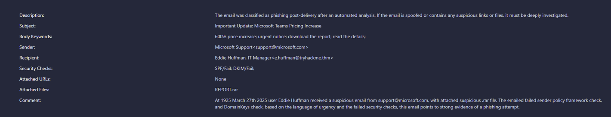
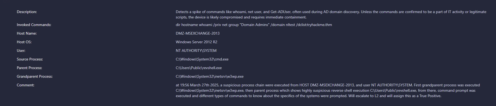

# SOC Level 1 Alert Reporting

## Objective

The objective of this lab was to practice writing clear Security Operations Center (SOC) alert reports based on investigation evidence.

This room focused on reviewing high-risk alerts, identifying suspicious indicators, making a triage decision, and documenting the findings clearly for escalation.

## Scenario Summary

This lab included multiple alerts that required analyst review and reporting. The two alerts documented in this writeup involved:

- A phishing email detected after delivery
- A suspicious process chain with domain discovery commands

The goal was to explain what happened, what evidence supported the decision, and what response actions should follow.

## Tools Used

- TryHackMe SOC Level 1 lab environment
- Alert details
- Email security checks
- Process chain review
- Command-line activity review
- MITRE ATT&CK

---

# Alert 1: Email Marked as Phishing After Delivery



*Figure 1: Phishing email alert showing failed SPF/DKIM checks and suspicious attachment.*

## Alert Summary

| Field | Details |
|---|---|
| Date/Time | March 27th, 2025 at 19:25 |
| Alert Name | Email Marked as Phishing after Delivery |
| Severity | High |
| Status | In Progress |
| Triage Decision | True Positive |
| Assigned To | L2 Analyst |
| Sender | Microsoft Support `<support@microsoft.com>` |
| Recipient | Eddie Huffman, IT Manager |
| Subject | Important Update: Microsoft Teams Pricing Increase |
| Security Checks | SPF Fail, DKIM Fail |
| Attached URLs | None |
| Attached File | REPORT.rar |

## 5 W's

| Question | Answer |
|---|---|
| Who? | Eddie Huffman received the email. The sender appeared as Microsoft Support. |
| What? | A suspicious email was marked as phishing after delivery. |
| When? | March 27th, 2025 at 19:25. |
| Where? | The email was delivered to the user's mailbox. |
| Why? | The email used urgent language, failed email authentication checks, and included a suspicious archive attachment. |
| How? | The email attempted to get the user to download an attached report. |

## Key Evidence

| Evidence | Why It Matters |
|---|---|
| SPF Fail | The sending server was not authorized by the claimed sender domain. |
| DKIM Fail | The email did not contain a valid domain signature. |
| Urgent wording | Urgency is commonly used in phishing emails to pressure users. |
| REPORT.rar attachment | Archive files can be used to hide suspicious or malicious files. |
| No attached URLs | The main concern was the attached file, not a link. |

## Analyst Comment

At 19:25 on March 27th, 2025, user Eddie Huffman received a suspicious email from support@microsoft.com with a suspicious .rar attachment. The email failed Sender Policy Framework (SPF) and DomainKeys Identified Mail (DKIM) checks. Based on the urgent language, failed security checks, and suspicious attachment, this email shows strong evidence of a phishing attempt.

## Analysis

This alert showed several signs of phishing. The email appeared to come from Microsoft Support, but it failed both SPF and DKIM authentication checks. The message also used urgent language about a Microsoft Teams pricing increase and included a compressed archive attachment named REPORT.rar.

The failed authentication checks suggest possible spoofing. The attachment also increases risk because archive files are commonly used in phishing attempts to hide suspicious files.

## Finding

This alert was assessed as a true positive phishing email.

## Recommended Remediation

- Quarantine the email.
- Check whether the recipient opened or downloaded the attachment.
- Review endpoint activity for signs of file execution.
- Search for similar emails sent to other users.
- Block related indicators if confirmed malicious.
- Remind users to be cautious with urgent emails and unexpected attachments.

## MITRE ATT&CK Mapping

| Tactic | Technique | Reason |
|---|---|---|
| Initial Access | Phishing | The email attempted to get the user to interact with a suspicious attachment. |
| Execution | User Execution | If opened, the attachment could require user interaction to execute malicious content. |

---

# Alert 2: Spike of Domain Discovery Commands



*Figure 2: Domain discovery alert showing suspicious process chain and discovery commands.*

## Alert Summary

| Field | Details |
|---|---|
| Date/Time | March 27th, 2025 at 19:56 |
| Alert Name | Spike of Domain Discovery Commands |
| Severity | Critical |
| Status | In Progress |
| Triage Decision | True Positive |
| Assigned To | L2 Analyst |
| Host Name | DMZ-MSEXCHANGE-2013 |
| Host OS | Windows Server 2012 R2 |
| User | NT AUTHORITY\SYSTEM |
| Source Process | C:\Windows\System32\cmd.exe |
| Parent Process | C:\Users\Public\revshell.exe |
| Grandparent Process | C:\Windows\System32\inetsrv\w3wp.exe |

## Invoked Commands

```text
dir
hostname
whoami /priv
net group "Domain Admins" /domain
nltest /dclist:tryhackme.thm
